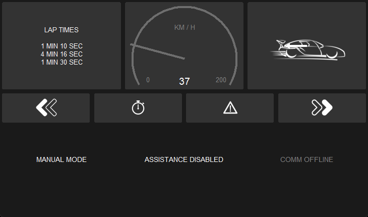

# LEADS: Lightweight Embedded Assisted Driving System


LEADS is a lightweight embedded assisted driving system. It is designed to simplify the development of the
instrumentation, control, and analysis system for racing cars. It is written in well-organized Python and C/C++ with
impressive performance. It is not only out-of-the-box ([LEADS VeC](https://leads-docs.projectneura.org/en/latest/vec))
but also fully customizable. It provides multiple abstract layers that allow users to pull out the components and
rearrange them into a new project. You can either configure the existing executable module `leads_vec` and
`leads_vec_rc` simply through a JSON file or write your own codes based on the framework as easily as building a LEGO.

The hardware components chosen for this project are geared towards amateur developers. It uses neither a CAN bus
(although it is supported) nor any dedicated circuit board, but generic development kits such as Raspberry Pi and
Arduino instead. However, as it is a high-level system running on a host computer, the software framework has the
ability to adapt to any type of hardware component if you are willing to write some codes.

This document will guide you through LEADS VeC. You will find a detailed version
[here](https://leads-docs.projectneura.org/en/latest/vec).

LEADS VeC Demo


LEADS VeC Demo (Manual Mode)



:link: [Docs](https://leads-docs.projectneura.org)

:link: [Remote Analyst Online Dashboard](https://leads-vec-rc.projectneura.org)

## Key Features

- [x] Modern UI design
- [x] Auto dark mode support
- [x] Fancy widgets
- [x] TCP communication system
- [x] Remote analyst
- [x] Replaying recorded data
- [x] Live video feed
- [ ] Data recording system with the following components
    - [x] A speed recording system
    - [ ] A G force recording system
    - [x] A GPS recording system
    - [x] A battery voltage recording system
- [ ] ESC with the following components
    - [x] DTCS (Dynamic Traction Control System)
    - [x] ABS (Anti-lock Braking System)
    - [ ] EBI (Emergency Braking Intervention)
    - [ ] ATBS (Automatic Trail Braking System)

## Installation

### Python

Note that LEADS requires **Python >= 3.12**. To set up the environment on a Raspberry Pi by only a single line of
command, see [Environment Setup](#environment-setup).

```shell
pip install "leads[standard]"
```

If your platform does not support GPIO, use profile "no-gpio.

```shell
pip install "leads[no-gpio]"
```

If you only want the framework, run the following.

```shell
pip install leads
```

#### Verify

```shell
leads-vec info
```

### Arduino

You can install [LEADS Arduino](https://github.com/ProjectNeura/LEADS-Arduino) from Arduino Library Manager. Note that
it is named "LEADS", not "LEADS-Arduino", in the index.

## LEADS Framework

See [Read the Docs](https://leads-docs.projectneura.org) for the documentation of how to customize and make use of
the framework in your project.

## Quick Start

### Main

```shell
leads-vec run
```

#### Optional Arguments

Run the following to get a list of all the supported arguments.

```shell
leads-vec -h
```

##### Specify a Configuration File

```shell
leads-vec -c path/to/the/config/file.json run
```

> You can use ":INTERNAL" to replace the path to `leads_vec`. For example, instead of typing
".../site-packages/leads_vec/devices_jarvis.py", simply use ":INTERNAL/devices_jarvis.py".

If not specified, all configurations will be default values.

To learn about the configuration file, read [Configurations](#Configurations).

##### Specify a Devices Module

```shell
leads-vec -d path/to/the/devices.py run
```

> You can use ":INTERNAL" to replace the path to `leads_vec`. For example, instead of typing
".../site-packages/leads_vec/devices_jarvis.py", simply use ":INTERNAL/devices_jarvis.py".

To learn about the devices module, read [Devices Module](#devices-module).

##### Specify a Main Module

```shell
leads-vec -m path/to/the/main.py run
```

> You can use ":INTERNAL" to replace the path to `leads_vec`. For example, instead of typing
".../site-packages/leads_vec/devices_jarvis.py", simply use ":INTERNAL/devices_jarvis.py".

Function `main()` must exist in the main module, otherwise an `ImportError` will be raised.

It needs to have the identical signature as the following.

```python
def main() -> int:
    """
    :return: 0: success; 1: error
    """
    ...
```

##### Generate a Configuration File

```shell
leads-vec -r config run
```

This will generate a default "config.json" file under the current directory.

##### Register a Systemd Service

```shell
leads-vec -r systemd run
```

This will register a user Systemd service to start the program.

To enable auto-start at boot, run the following.

```shell
systemctl --user daemon-reload
systemctl --user enable leads-vec
```

You will have to stop the service by this command otherwise it will automatically restart when it exits.

```shell
systemctl --user stop leads-vec
```

Use the following to disable the service.

```shell
systemctl --user disable leads-vec
```

##### Use Reverse Proxy

```shell
leads-vec -r reverse_proxy run
```

This will start the corresponding reverse proxy program as a subprocess in the background.

##### Specify a Theme

```shell
leads-vec -t path/to/the/theme.json run
```

> You can use ":INTERNAL" to replace the path to `leads_vec`. For example, instead of typing
".../site-packages/leads_vec/devices_jarvis.py", simply use ":INTERNAL/devices_jarvis.py".

To learn about themes, read [Color and Themes](https://customtkinter.tomschimansky.com/documentation/color).

##### Magnify Font Sizes

```shell
leads-vec -mfs 1.5 run
```

This will magnify all font sizes by 1.5.

##### Use Emulation

```shell
leads-vec --emu run
```

This will force the program to use emulation even if the environment is available.

##### Automatically Magnify Font Sizes

```shell
leads-vec --auto-mfs run
```

Similar to [Magnify Font Sizes](#magnify-font-sizes), but instead of manually deciding the factor, the program will
automatically calculate the best factor to keep the original proportion as designed.

### Remote Analyst

The remote analyst requires additional dependencies. Install them through the following command.

```shell
pip install "leads[all]"
```

```shell
leads-vec-rc
```

Go to the online dashboard at https://leads-vec-rc.projectneura.org.

#### Optional Arguments

Run the following to get a list of all the supported arguments.

```shell
leads-vec-rc -h
```

##### Server Port

```shell
leads-vec-rc -p 80
```

If not specified, the port is `8000` by default.

##### Specify a Configuration File

```shell
leads-vec-rc -c path/to/the/config/file.json
```

If not specified, all configurations will be default values.

To learn about the configuration file, read [Configurations](#configurations).

## Environment Setup

This section helps you set up the identical environment we have for the VeC project. A more detailed guide of
reproduction is available [here](https://leads-docs.projectneura.org/en/latest/vec/user-manual.html), but first of all,
we run an Ubuntu on a Raspberry Pi 4 Model B 8GB. After the OS is set up, just run the one-line commands listed below.
You may also choose to clone the repository or download the scripts from
[releases](https://github.com/ProjectNeura/LEADS/releases) (only stable releases provide scripts).

These scripts currently only support `apt` as the package manager.

If you install Python using the scripts, you will not find `python ...`, `python3 ...`, `pip ...`, or `pip3 ...` working
because you have to specify the Python interpreter such that `python-leads ...` and `pip-leads ...`.

### LEADS

You can simply run "[setup.sh](scripts/setup.sh)" and it will install everything including Python 3.12 all the optional
dependencies of LEADS for you.

```shell
bash "setup.sh$(wget -O setup.sh https://raw.githubusercontent.com/ProjectNeura/LEADS/main/scripts/setup.sh)" && rm setup.sh || rm setup.sh
```

This will create a shortcut to save you from typing `python-leads -m leads_vec ...`, instead, you will just need to call
`leads-vec ...`.

### Python

[python-install.sh](scripts/python-install.sh) will only install Python 3.12 and Tcl/Tk.

```shell
bash "python-install.sh$(wget -O python-install.sh https://raw.githubusercontent.com/ProjectNeura/LEADS/main/scripts/python-install.sh)" && rm python-install.sh || rm python-install.sh
```

### FRP

#### Install

We use FRP for reverse proxy. This is optional if you do not need public connections. If you want, install it through
"[frp-install.sh](scripts/frp-install.sh)".

```shell
bash "frp-install.sh$(wget -O frp-install.sh https://raw.githubusercontent.com/ProjectNeura/LEADS/main/scripts/frp-install.sh)" && rm frp-install.sh || rm frp-install.sh
```

#### Configure

To configure FRP, use "[frp-config.sh](scripts/frp-config.sh)".

```shell
bash "frp-config.sh$(wget -O frp-config.sh https://raw.githubusercontent.com/ProjectNeura/LEADS/main/scripts/frp-config.sh)" && rm frp-config.sh || rm frp-config.sh
```

There are 4 arguments for this script, of which the first 2 are required.

```shell
bash "frp-config.sh$(...)" {frp_server_ip} {frp_token} {frp_port} {comm_port} && rm frp-config.sh || rm frp-config.sh
```

### Uninstall

To uninstall LEADS, we provide an easy solution as well. However, it uninstalls a component only if it is installed
through the way listed in [Environment Setup](#environment-setup).

```shell
bash "uninstall.sh$(wget -O uninstall.sh https://raw.githubusercontent.com/ProjectNeura/LEADS/main/scripts/uninstall.sh)" && rm uninstall.sh || rm uninstall.sh
```

## Configurations

The configuration is a JSON file that has the following settings. You can have an empty configuration file like the
following as all the settings are optional.

```json
{}
```

Note that a purely empty file could cause an error.

| Index                  | Type    | Usage                                                     | Used By      | Default       |
|------------------------|---------|-----------------------------------------------------------|--------------|---------------|
| `w_debug_level`        | `str`   | `"DEBUG"`, `"INFO"`, `"WARN"`, `"ERROR"`                  | Main, Remote | `"DEBUG"`     |
| `data_seq_size`        | `int`   | Buffer size of history data                               | Main         | `100`         |
| `width`                | `int`   | Window width                                              | Main         | `720`         |
| `height`               | `int`   | Window height                                             | Main         | `480`         |
| `fullscreen`           | `bool`  | `True`: auto maximize; `False`: window mode               | Main         | `False`       |
| `no_title_bar`         | `bool`  | `True`: no title bar; `False`: default title bar          | Main         | `False`       |
| `theme_mode`           | `bool`  | `"system"`, `"light"`, `"dark`"                           | Main         | `False`       |
| `manual_mode`          | `bool`  | `True`: hide control system; `False`: show control system | Main         | `False`       |
| `refresh_rate`         | `int`   | GUI frame per second                                      | Main         | `30`          |
| `m_ratio`              | `float` | Meter widget size ratio                                   | Main         | `0.7`         |
| `num_external_screens` | `int`   | The number of external screens used if possible           | Main         | `0`           |
| `font_size_small`      | `int`   | Small font size                                           | Main         | `14`          |
| `font_size_medium`     | `int`   | Medium font size                                          | Main         | `28`          |
| `font_size_large`      | `int`   | Large font size                                           | Main         | `42`          |
| `font_size_x_large`    | `int`   | Extra large font size                                     | Main         | `56`          |
| `comm_addr`            | `str`   | Communication server address                              | Remote       | `"127.0.0.1"` |
| `comm_port`            | `int`   | The port on which the communication system runs on        | Main, Remote | `16900`       |
| `comm_stream`          | `bool`  | `True`: enable streaming; `False`: disable streaming      | Main         | `False`       |
| `comm_stream_port`     | `bool`  | The port on which the streaming system runs on            | Main, Remote | `16901`       |
| `data_dir`             | `str`   | The directory for the data recording system               | Remote       | `"data"`      |
| `save_data`            | `bool`  | `True`: save data; `False`: discard data                  | Remote       | `False`       |

## Devices Module

### Example

```python
from leads import controller, MAIN_CONTROLLER
from leads_emulation import RandomController


@controller(MAIN_CONTROLLER)
class MainController(RandomController):
    pass
```

The devices module will be executed after configuration registration. Register your devices in this module using AOP
paradigm. A more detailed explanation can be found [here](https://leads-docs.projectneura.org/en/latest/device.html).

## Architecture

### Main

#### Pin Configuration


### Remote Analyst


## Collaborations

### Community

#### Issues

Our team management completely relies on GitHub. Tasks are published and assigned as
[issues](https://github.com/ProjectNeura/LEADS/issues). You will be notified if you are assigned to certain tasks.
However, you may also join other discussions for which you are not responsible.

There are a few labels that classify the issues.

- `bug` reports a bug
- `code review` discusses a code review or comment
- `documentation` suggests a documentation enhancement
- `duplicate` marks that a similar issue has been raised
- `enhancement` proposes a new feature or request
- `help wanted` means that extra attention is needed to this issue
- `invalid` marks that the issue is in a valid format
- `question` requests further information
- `report` states that it is discussed in the meeting
- `todo` creates a new task
- `wontfix` marks that the issue is ignored

Label your issue with at least one of the labels above before you submit.

#### Projects

You can have a look at the whole schedule of each project in a timeline using
the [projects](https://github.com/orgs/ProjectNeura/projects) feature.

### Code Contributions

See [CONTRIBUTING.md](CONTRIBUTING.md).
