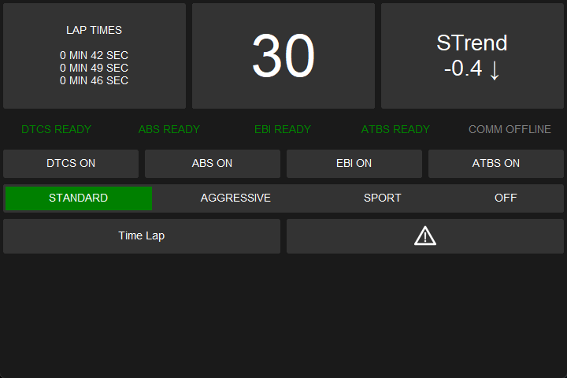
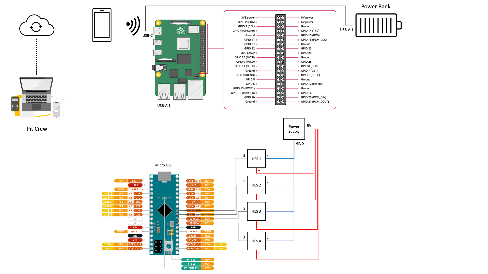
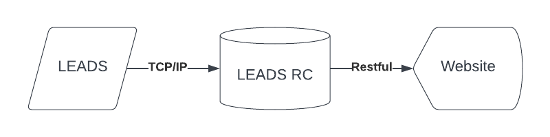

# LEADS: Lightweight Embedded Assisted Driving System


LEADS is a lightweight embedded assisted driving system. It is designed to simplify the development of the instrumentation system for electric vehicles. It is written in well-organized Python and C/C++ with impressive performance. It is not only plug-and-play ([VeC Project](https://www.villanovacollege.org/giving/vec-project)) but also fully customizable. It provides multiple abstract layers that allow users to pull out the components and rearrange them into a new project. You can either configure the existing executable module `leads_vec` and `leads_vec_rc` simply through a JSON file or write your own codes based on the framework as easily as building a LEGO.

The hardware components chosen for this project are geared towards amateur developers. It uses no dedicated circuit boards, but generic development kits such as Raspberry Pi and Arduino instead. However, if you wish to write some codes, the software framework has the ability to adapt to any type of hardware component.

Before you start, please note that LEADS only supports rear drive and two drive-wheel configurations: single rear
wheel (SRW) mode and dual rear wheel (DRW) mode.



## Key Features

- [x] A basic instrumentation system
- [x] A basic communication system
- [x] A basic control system
- [ ] A data recording system with the following components
  - [x] A speed recording system
  - [ ] A G force recording system
  - [ ] A GPS recording system
  - [ ] A battery voltage recording system
- [ ] A control system with the following components
  - [ ] DTCS (Dynamic Traction Control System)
  - [ ] ABS (Anti-lock Braking System)
  - [ ] EBI (Emergency Braking Intervention)
  - [ ] ATBS (Automatic Trail Braking System)

## To High School Students


The codes are never designed for average high school students to understand. You may find it hard to read the codes if you do not satisfy the following requirements of skills and knowledge.

- Advanced Python knowledge (you should be familiar with everything and even programming philosophy in Python)
- Solid knowledge of Physics (you should understand how a car moves in reality)
- Basic embedded development experience (C/C++, Raspberry Pi, Arduino, serial communication, PWM)
- Rich experience in Web development (React, NextJS, FastAPI, TCP/IP, sockets)
- Basic machine learning knowledge (linear regression, polynomial regression)

## Installation

### Python

Note that LEADS requires **Python >= 3.12**.

```shell
pip install customtkinter keyboard pyserial leads
```

`numpy` will be automatically installed with `leads`.

`customtkinter`, `keyboard`, and `pyserial` are optional.

If you only want the framework, run the following.

```shell
pip install leads
```

#### Verify

```shell
python -m leads_vec info
```

### Arduino

You can install [LEADS-Arduino](https://github.com/ProjectNeura/LEADS-Arduino) from Arduino Library Manager. Note that it is named "LEADS", not "LEADS-Arduino", in the index.

## LEADS Framework

See [Read the Docs](https://leads.projectneura.org) (TBC) for the documentation of how to customize and make use of the framework in your project.

## Quick Start

### Main

```shell
python -m leads_vec run
```

#### Optional Arguments

Run the following to get a list of all the supported arguments.

```shell
python -m leads_vec -h
```

##### Specify a Configuration File

```shell
python -m leads_vec -c path/to/the/config/file.json run
```

If not specified, all configurations will be default values.

To learn about the configuration file, read [Configurations](#Configurations).

##### Generate a Configuration File

```shell
python -m leads_vec -r config run
```

This will generate a default "config.json" file under the current directory.

##### Register as a Systemd Service

```shell
python -m leads_vec -r systemd run
```

This will register a system service to start the program.

To enable auto-start at boot, run the following.

```shell
systemctl daemon-reload
systemctl enable leads_vec
```

### Remote Controller

```shell
python -m leads_vec_rc
```

Go to the online dashboard https://leads-vec-rc.projectneura.org.

#### Register as a Systemd Service

```shell
python -m leads_vec_rc -r systemd
```

This will register a system service to start the program.

To enable auto-start at boot, run the following.

```shell
systemctl daemon-reload
systemctl enable leads_vec_rc
```

## Environment Setup

This section helps you set up the exact environment we have for the VeC project. A more detailed guide of reproduction is available on [https://leads.projectneura.org](https://leads.projectneura.org), but first of all, we run an Ubuntu 22.04 LTS on a Raspberry Pi 4 Model B 8GB. After the OS is set up, clone the repository or download the scripts from [releases](https://github.com/ProjectNeura/LEADS/releases) (only stable releases provide scripts).

You can simply run "[setup.sh](scripts/setup.sh)" and it will install everything for you. If anything goes wrong, you can also manually install everything.

If you install Python using the scripts, you will not find `python ...`, `python3 ...`, `pip ...`, or `pip3 ...` working
because you have to specify the Python version such that `python3.12 ...` and `python3.12 -m pip ...`.

## Configurations

The configuration is a JSON file that has the following columns. You can have an empty configuration file like the following as all the columns are optional.

```json
{}
```

Note that a purely empty file could cause an error.

|                           | Type   | Usage                                                              | Used By      | Default       |
|---------------------------|--------|--------------------------------------------------------------------|--------------|---------------|
| `srw_mode`                | `bool` | `True`: single rear wheel; `False`: dual rear wheel                | Main, Remote | `True`        |
| `width`                   | `int`  | Window width                                                       | Main         | `720`         |
| `height`                  | `int`  | Window height                                                      | Main         | `480`         |
| `fullscreen`              | `bool` | `True`: auto maximize; `False`: window mode                        | Main         | `False`       |
| `no_title_bar`            | `bool` | `True`: no title bar; `False`: default title bar                   | Main         | `False`       |
| `manual_mode`             | `bool` | `True`: hide control system; `False`: show control system          | Main         | `False`       |
| `refresh_rate`            | `int`  | GUI frame per second                                               | Main         | `30`          |
| `font_size_small`         | `int`  | Small font size                                                    | Main         | `8`           |
| `font_size_medium`        | `int`  | Medium font size                                                   | Main         | `16`          |
| `font_size_large`         | `int`  | Large font size                                                    | Main         | `32`          |
| `font_size_x_large`       | `int`  | Extra large font size                                              | Main         | `48`          |
| `comm_addr`               | `str`  | Communication server address                                       | Remote       | `"127.0.0.1"` |
| `comm_port`               | `int`  | The port on which the communication system runs on                 | Main, Remote | `16900`       |
| `data_dir`                | `str`  | The directory for the data recording system                        | Remote       | `"./data"`    |
| `enable_data_persistence` | `bool` | `True`: enable data persistence; `False`: disable data persistence | Remote       | `True`        |

## Submodules

- [LEADS-Arduino](https://github.com/ProjectNeura/LEADS-Arduino)
- [leads-docs](https://github.com/ProjectNeura/leads-docs)
- [leads-vec-rc](https://github.com/ProjectNeura/leads-vec-rc) (Private)

## Periodic Report

See [reports](docs/reports).

## Architecture

### Main

#### Pin Configuration



### Remote Controller



## Collaborations

### Community

#### Issues

Our team management completely relies on GitHub. Tasks are published and assigned as [issues](https://github.com/ProjectNeura/LEADS/issues). You will be notified if you are assigned to certain tasks. However, you may also join other discussions for which you are not responsible.

There are a few labels that classify the issues.

- `bug` reports a bug
- `code review` discusses a code review or comment
- `documentation` suggests a documentation enhancement
- `duplicate` marks that a similar issue has been raised
- `enhancement` proposes a new feature or request
- `help wanted` means that extra attention is needed to this issue
- `invalid` marks that the issue is in a valid format
- `question` requests further information
- `report` starts a periodic report discussion
- `todo` creates a new task
- `wontfix` marks that the issue is ignored

Label your issue with at least one of the labels above before you submit.

#### Projects

You can have a look at the whole schedule of each project in a timeline using the [projects](https://github.com/orgs/ProjectNeura/projects/) feature.

### Code Contributions

See [CONTRIBUTING.md](CONTRIBUTING.md).
