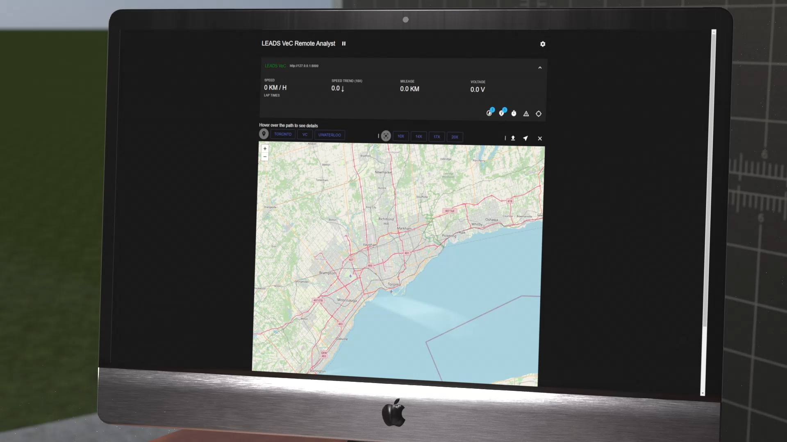

# LEADS: Lightweight Embedded Assisted Driving System


LEADS is a lightweight embedded assisted driving system. It is designed to simplify the development of the
instrumentation, control, and analysis system for racing cars. It is written in well-organized Python and C/C++ with
impressive performance. It is not only out-of-the-box ([LEADS VeC](https://leads-docs.projectneura.org/en/latest/vec))
but also fully customizable. It provides multiple abstract layers that allow users to pull out the components and
rearrange them into a new project. You can either configure the existing executable module `leads_vec` and
`leads_vec_rc` simply through a JSON file or write your own codes based on the framework as easily as building a LEGO.

The hardware components chosen for this project are geared towards amateur developers. It uses neither a CAN bus
(although it is supported) nor any dedicated circuit board, but generic development kits such as Raspberry Pi and
Arduino instead. However, as it is a high-level system running on a host computer, the software framework has the
ability to adapt to any type of hardware component if you are willing to write some codes.

This document will guide you through LEADS VeC. You will find a detailed version
[here](https://leads-docs.projectneura.org/en/latest/vec). If you are confused with the difference between LEADS and
LEADS VeC, check out our definition of the LEADS ecology [here](https://leads.projectneura.org).

:link: [Home](https://leads.projectneura.org)

:link: [News](https://x.com/ProjectNeura)

:link: [Docs](https://leads-docs.projectneura.org)

:link: [LEADS VeC Remote Analyst Online Dashboard](https://leads-vec-rc.projectneura.org)

## Why LEADS?

<details>
<summary>Robust framework and good compatibility</summary>

LEADS framework ensures that its applications, including LEADS VeC, have extremely high standards. They usually provide
promising safety, but still, always keep our
[Safety Instructions](https://leads-docs.projectneura.org/en/latest/vec/safety-instructions.html) in mind.


</details>

<details>
<summary>Modern GUI design</summary>
<details>
<summary>Dark mode support</summary>

LEADS inherently supports dark mode. You can simply change your system preference and LEADS will follow.

</details>
<details>
<summary>High performance</summary>

Even with extraordinary details and animation, we still manages to provide you with incredible performance.

| Test Platform              | Maximum Refresh Rate (FPS) |
|----------------------------|----------------------------|
| Macbook Pro (M3)           | 260                        |
| Raspberry Pi 5 8GB         | 100                        |
| Raspberry Pi 4 Model B 8GB | 60                         |

</details>
<details>
<summary>External screens</summary>

LEADS supports an unlimited number of displays. You can enable a specific number of displays simply through a
configuration.


</details>


</details>

<details>
<summary>Powerful ESC system</summary>
<details>
<summary>DTCS (Dynamic Traction Control System)</summary>

DTCS helps you control the amount of rear wheel slip by detecting and comparing the speed difference between all wheels.
It allows a certain amount of drift while ensuring grip.

</details>
<details>
<summary>ABS (Anti-lock Braking System)</summary>

ABS allows the driver to safely step on the brakes to the bottom without locking the brakes. Although this may increase
braking distances, it ensures you always have grip.

</details>
<details>
<summary>EBI (Emergency Braking Intervention)</summary>

EBI is available on most modern family cars. It actively applies the brakes at the limit of the braking distance. This
system greatly reduces the probability of rear-end collisions.

</details>
<details>
<summary>ATBS (Automatic Trail Braking System)</summary>

ATBS monitors the steering angle and adjusts the brakes in time to ensure that the front of the car obtains the
corresponding downforce. Its intervention will avoid under-steer (pushing the head) or oversteer (drifting).

</details>
<details>
<summary>Manual mode</summary>

It is not surprising that some racing events do not allow control of the vehicle beyond the driver. Therefore, we
provide a manual mode where all assistance is forcibly disabled. You can simply set configuration `manual_mode` to
`True` to enable this mode.


</details>

All 4 systems have 4 calibrations: standard, aggressive, sport, and off. Their intervention comes later than the
previous respectively.

</details>

<details>
<summary>Real-time data sharing and persistence platform</summary>

Thanks to our built-in TCP communication system, we are able to establish a powerful data link where the vehicle is the
server and can connect to multiple clients. All data collected through LEADS can be distributed to the pit crew or
anywhere far from the vehicle within an unnoticeable time, and that is not the end of the data's travel.

We are a big fan of data collection. With our data persistence technologies, all data are saved in popular formats such
as CSV, and processed in an intuitive way by LEADS VeC Data Processor.

During the development of LEADS, we have accumulated massive amounts of real-world data that can be made into public
road datasets.

</details>

<details>
<summary>Live video streaming</summary>

As an organization that is deeply rooted in AI, visual data has special meaning to us. In LEADS, we value visual inputs
more than any other framework. Our official support of low-latency video encoding and streaming has made LEADS natively
suitable for AI applications.

LEADS is one of the few solutions on embedded single-board computers that support multiple cameras with an excellent
performance.

</details>

<details>
<summary>Transparency between the driver and the pit crew</summary>
<details>
<summary>LEADS VeC Remote Analyst</summary>

LEADS VeC Remote Analyst is designed so that the pit crew can track the vehicle. It consists of a local web server and a
frontend website.



</details>

With the LEADS, what the driver sees and feels is all shared with the pit crew in real time through our data link. The
pit crew now masters every single bit of detail of the vehicle. This advantage will help the team avoid 99% of
communication barriers.

</details>

<details>
<summary>Time machine with recorded data</summary>

Having the data saved by our data platform, you can easily run LEADS on a laptop and travel back to the time when the
data was recorded.

</details>

<details>
<summary>AI-enhanced data analysis and driver training</summary>

Powered by rich datasets, our ambition is to change car racing as a whole, just as AlphaGo changed Go. This blueprint
has never been such easy as today thanks to AI.


</details>

## Installation

### Python

Note that LEADS requires **Python >= 3.12**. To set up the environment on a Raspberry Pi by only a single line of
command, see [Environment Setup](#environment-setup).

```shell
pip install "leads[standard]"
```

If you only want the framework, run the following.

```shell
pip install leads
```

This table lists all installation profiles.

| Profile              | Content                                                         | For                                              | All Platforms |
|----------------------|-----------------------------------------------------------------|--------------------------------------------------|---------------|
| leads                | Only the framework                                              | LEADS Framework                                  | &check;       |
| "leads[standard]"    | The framework and necessary dependencies                        | LEADS Framework                                  | &check;       |
| "leads[gpio]"        | Everything "leads[standard]" has plug `lgpio`                   | LEADS Framework                                  | &cross;       |
| "leads[vec]"         | Everything "leads[gpio]" has plus `pynput`                      | LEADS VeC                                        | &cross;       |
| "leads[vec-no-gpio]" | Everything "leads[standard]" has plus `pynput`                  | LEADS VeC (if you are not using any GPIO device) | &check;       |
| "leads[vec-rc]"      | Everything "leads[standard]" has plus `"fastapi[standard]`      | LEADS VeC Remote Analyst                         | &check;       |
| "leads[vec-dp]"      | Everything "leads[standard]" has plus `matplotlib` and `pyyaml` | LEADS VeC Data Processor                         | &check;       |

### Arduino

You can install [LEADS Arduino](https://github.com/ProjectNeura/LEADS-Arduino) from Arduino Library Manager. Note that
it is named "LEADS", not "LEADS-Arduino", in the index.

## LEADS Framework

See [Read the Docs](https://leads-docs.projectneura.org) for the documentation of how to customize and make use of
the framework in your project.

## Quick Start

### Main

```shell
leads-vec run
```

#### Verify

```shell
leads-vec info
```

#### Replay

```shell
leads-vec replay
```

Replaying requires "main.csv" under the data directory. It as well accepts all optional arguments listed below.

#### Optional Arguments

Run the following to get a list of all the supported arguments.

```shell
leads-vec -h
```

##### Specify a Configuration File

```shell
leads-vec -c path/to/the/config/file.json run
```

> You can use ":INTERNAL" to replace the path to `leads_vec`. For example, instead of typing
".../site-packages/leads_vec/devices_jarvis.py", simply use ":INTERNAL/devices_jarvis.py".

If not specified, all configurations will be default values.

To learn about the configuration file, read [Configurations](#Configurations).

##### Specify a Devices Module

```shell
leads-vec -d path/to/the/devices.py run
```

> You can use ":INTERNAL" to replace the path to `leads_vec`. For example, instead of typing
".../site-packages/leads_vec/devices_jarvis.py", simply use ":INTERNAL/devices_jarvis.py".

To learn about the devices module, read [Devices Module](#devices-module).

##### Specify a Main Module

```shell
leads-vec -m path/to/the/main.py run
```

> You can use ":INTERNAL" to replace the path to `leads_vec`. For example, instead of typing
".../site-packages/leads_vec/devices_jarvis.py", simply use ":INTERNAL/devices_jarvis.py".

Function `main()` must exist in the main module, otherwise an `ImportError` will be raised.

It needs to have the identical signature as the following.

```python
def main() -> int:
    """
    :return: 0: success; 1: error
    """
    ...
```

##### Generate a Configuration File

```shell
leads-vec -r config run
```

This will generate a default "config.json" file under the current directory.

##### Register a Systemd Service

```shell
leads-vec -r systemd run
```

This will register a user Systemd service to start the program.

To enable auto-start at boot, run the following.

```shell
systemctl --user daemon-reload
systemctl --user enable leads-vec
```

You will have to stop the service by this command otherwise it will automatically restart when it exits.

```shell
systemctl --user stop leads-vec
```

Use the following to disable the service.

```shell
systemctl --user disable leads-vec
```

##### Use Reverse Proxy

```shell
leads-vec -r reverse_proxy run
```

This will start the corresponding reverse proxy program as a subprocess in the background.

##### Customize the Splash Screen

```shell
leads-vec -r splash_screen run
```

This will replace the splash and lock screen with LEADS' logo.

##### Magnify Font Sizes

```shell
leads-vec -mfs 1.5 run
```

This will magnify all font sizes by 1.5.

##### Use Emulation

```shell
leads-vec --emu run
```

This will force the program to use emulation even if the environment is available.

##### Automatically Magnify Font Sizes

```shell
leads-vec --auto-mfs run
```

Similar to [Magnify Font Sizes](#magnify-font-sizes), but instead of manually deciding the factor, the program will
automatically calculate the best factor to keep the original proportion as designed.

### Remote Analyst

```shell
leads-vec-rc
```

Go to the online dashboard at https://leads-vec-rc.projectneura.org.

#### Optional Arguments

Run the following to get a list of all the supported arguments.

```shell
leads-vec-rc -h
```

##### Server Port

```shell
leads-vec-rc -p 80
```

If not specified, the port is `8000` by default.

##### Specify a Configuration File

```shell
leads-vec-rc -c path/to/the/config/file.json
```

If not specified, all configurations will be default values.

To learn about the configuration file, read [Configurations](#configurations).

### Data Processor

```shell
leads-vec-dp path/to/the/workflow.yml
```

To learn more about workflows, read [Workflows](#workflows).

## Environment Setup

This section helps you set up the identical environment we have for the VeC project. A more detailed guide of
reproduction is available [here](https://leads-docs.projectneura.org/en/latest/vec/user-manual.html), but first of all,
we run an Ubuntu on a Raspberry Pi 4 Model B 8GB. After the OS is set up, just run the one-line commands listed below.
You may also choose to clone the repository or download the scripts from
[releases](https://github.com/ProjectNeura/LEADS/releases) (only stable releases provide scripts).

These scripts currently only support `apt` as the package manager.

If you install Python using the scripts, you will not find `python ...`, `python3 ...`, `pip ...`, or `pip3 ...` working
because you have to specify the Python interpreter such that `python-leads ...` and `pip-leads ...`.

### LEADS

You can simply run "[setup.sh](scripts/setup.sh)" and it will install everything including Python 3.12 all the optional
dependencies of LEADS for you.

```shell
bash "setup.sh$(wget -O setup.sh https://raw.githubusercontent.com/ProjectNeura/LEADS/main/scripts/setup.sh)" && rm setup.sh || rm setup.sh
```

This will create a shortcut to save you from typing `python-leads -m leads_vec ...`, instead, you will just need to call
`leads-vec ...`.

### Python

[python-install.sh](scripts/python-install.sh) will only install Python 3.12 and Tcl/Tk.

```shell
bash "python-install.sh$(wget -O python-install.sh https://raw.githubusercontent.com/ProjectNeura/LEADS/main/scripts/python-install.sh)" && rm python-install.sh || rm python-install.sh
```

### FRP

#### Install

We use FRP for reverse proxy. This is optional if you do not need public connections. If you want, install it through
"[frp-install.sh](scripts/frp-install.sh)".

```shell
bash "frp-install.sh$(wget -O frp-install.sh https://raw.githubusercontent.com/ProjectNeura/LEADS/main/scripts/frp-install.sh)" && rm frp-install.sh || rm frp-install.sh
```

#### Configure

To configure FRP, use "[frp-config.sh](scripts/frp-config.sh)".

```shell
bash "frp-config.sh$(wget -O frp-config.sh https://raw.githubusercontent.com/ProjectNeura/LEADS/main/scripts/frp-config.sh)" && rm frp-config.sh || rm frp-config.sh
```

There are 4 arguments for this script, of which the first 2 are required.

```shell
bash "frp-config.sh$(...)" {frp_server_ip} {frp_token} {frp_port} {comm_port} && rm frp-config.sh || rm frp-config.sh
```

### Uninstall

To uninstall LEADS, we provide an easy solution as well. However, it uninstalls a component only if it is installed
through the way listed in [Environment Setup](#environment-setup).

```shell
bash "uninstall.sh$(wget -O uninstall.sh https://raw.githubusercontent.com/ProjectNeura/LEADS/main/scripts/uninstall.sh)" && rm uninstall.sh || rm uninstall.sh
```

## Configurations

The configuration is a JSON file that has the following settings. You can have an empty configuration file like the
following as all the settings are optional.

```json
{}
```

Note that a purely empty file could cause an error.

| Index                  | Type    | Usage                                                                                 | Used By      | Default       |
|------------------------|---------|---------------------------------------------------------------------------------------|--------------|---------------|
| `w_debug_level`        | `str`   | `"DEBUG"`, `"INFO"`, `"WARN"`, `"ERROR"`                                              | Main, Remote | `"DEBUG"`     |
| `data_seq_size`        | `int`   | Buffer size of history data                                                           | Main         | `100`         |
| `width`                | `int`   | Window width                                                                          | Main         | `720`         |
| `height`               | `int`   | Window height                                                                         | Main         | `480`         |
| `fullscreen`           | `bool`  | `True`: auto maximize; `False`: window mode                                           | Main         | `False`       |
| `no_title_bar`         | `bool`  | `True`: no title bar; `False`: default title bar                                      | Main         | `False`       |
| `theme`                | `str`   | Path to the [theme](https://customtkinter.tomschimansky.com/documentation/color) file | Main         | `""`          |
| `theme_mode`           | `bool`  | `"system"`, `"light"`, `"dark`"                                                       | Main         | `False`       |
| `manual_mode`          | `bool`  | `True`: hide control system; `False`: show control system                             | Main         | `False`       |
| `refresh_rate`         | `int`   | GUI frame rate                                                                        | Main         | `30`          |
| `m_ratio`              | `float` | Meter widget size ratio                                                               | Main         | `0.7`         |
| `num_external_screens` | `int`   | Number of external screens used if possible                                           | Main         | `0`           |
| `font_size_small`      | `int`   | Small font size                                                                       | Main         | `14`          |
| `font_size_medium`     | `int`   | Medium font size                                                                      | Main         | `28`          |
| `font_size_large`      | `int`   | Large font size                                                                       | Main         | `42`          |
| `font_size_x_large`    | `int`   | Extra large font size                                                                 | Main         | `56`          |
| `comm_addr`            | `str`   | Communication server address                                                          | Remote       | `"127.0.0.1"` |
| `comm_port`            | `int`   | Port on which the communication system runs on                                        | Main, Remote | `16900`       |
| `comm_stream`          | `bool`  | `True`: enable streaming; `False`: disable streaming                                  | Main         | `False`       |
| `comm_stream_port`     | `bool`  | Port on which the streaming system runs on                                            | Main, Remote | `16901`       |
| `data_dir`             | `str`   | Directory for the data recording system                                               | Main, Remote | `"data"`      |
| `save_data`            | `bool`  | `True`: save data; `False`: discard data                                              | Remote       | `False`       |

## Workflows

This only applies to LEADS VeC Data Processor. Please find a more detailed version
[here](https://leads-docs.projectneura.org/en/latest/vec/index.html#workflows).

```yaml
dataset: "data/main.csv"
inferences:
  repeat: 100  # default: 1
  enhanced: true  # default: false
  assume_initial_zeros: true  # default: false
  methods:
    - safe-speed
    - speed-by-acceleration
    - speed-by-mileage
    - speed-by-gps-ground-speed
    - speed-by-gps-position
    - forward-acceleration-by-speed
    - milage-by-speed
    - milage-by-gps-position
    - visual-data-realignment-by-latency

jobs:
  - name: Task 1
    uses: bake
  - name: Task 2
    uses: process
    with:
      lap_time_assertions: # default: []
        - 120  # lap 1 duration (seconds)
        - 180  # lap 2 duration (seconds)
      vehicle_hit_box: 5  # default: 3
      min_lap_time: 60  # default: 30 (seconds)
  - name: Draw Lap 5
    uses: draw-lap
    with:
      lap_index: 4  # default: -1
  - name: Suggest on Lap 5
    uses: suggest-on-lap
    with:
      lap_index: 4
  - name: Draw Comparison of Laps
    uses: draw-comparison-of-laps
    with:
      width: 0.5  # default: 0.3
  - name: Extract Video
    uses: extract-video
    with:
      file: rear-view.mp4  # destination to save the video
      tag: rear  # front, left, right, or rear
  - name: Save
    uses: save-as
    with:
      file: data/new.csv
```

## Devices Module

### Example

```python
from leads import controller, MAIN_CONTROLLER
from leads_emulation import RandomController


@controller(MAIN_CONTROLLER)
class MainController(RandomController):
    pass
```

The devices module will be executed after configuration registration. Register your devices in this module using AOP
paradigm. A more detailed explanation can be found [here](https://leads-docs.projectneura.org/en/latest/device.html).

## Architecture

### Remote Analyst


## Collaborations

### Community

#### Issues

Our team management completely relies on GitHub. Tasks are published and assigned as
[issues](https://github.com/ProjectNeura/LEADS/issues). You will be notified if you are assigned to certain tasks.
However, you may also join other discussions for which you are not responsible.

#### Projects

You can have a look at the whole schedule of each project in a timeline using
the [projects](https://github.com/orgs/ProjectNeura/projects) feature.

### Code Contributions

See [CONTRIBUTING.md](CONTRIBUTING.md).
